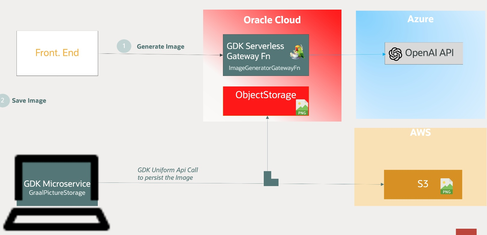
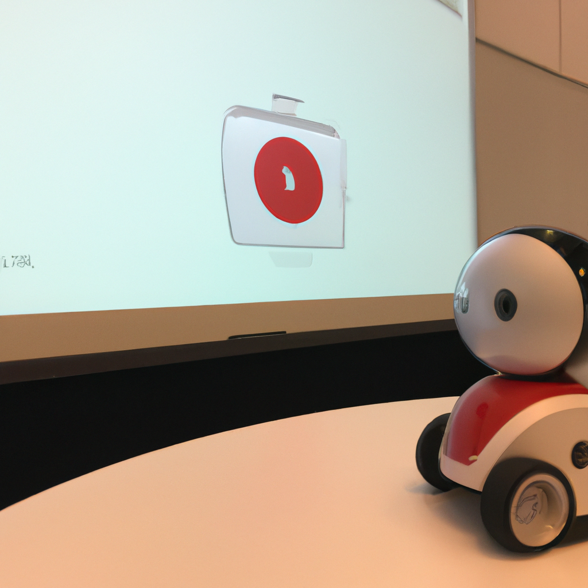

# Accelerating Multicloud Application SLDC  With Graal Development Kit 

This repository demonstrate how to build test and deploy a Multicloud  with [GraalVM Development Kit for Micronaut](https://graal.cloud/gcn/) (GDK)
It is divided in two independent GDK  projects
1. ImageGeneratorGatewayFn
2. GraalPictureStorage

## ! Disclaimer
:warning: While writing this post the GDK was known as Graal Cloud Native ( GCN). The renaming process is still in progress


## Prerequisites
1. Both projects relies on [Maven](https://maven.apache.org/) for build but it is quite simple to adapt it with Gradle.
2. Install GDK client and GraalVM 
```bash
$ sdk install java 21.0.3-oracle
$ sdk install gcn
```
3. Check your java runtime environment 
```sh
$ java -version
java version "21.0.3" 2024-04-16 LTS
Java(TM) SE Runtime Environment Oracle GraalVM 21.0.3+7.1 (build 21.0.3+7-LTS-jvmci-23.1-b37)
Java HotSpot(TM) 64-Bit Server VM Oracle GraalVM 21.0.3+7.1 (build 21.0.3+7-LTS-jvmci-23.1-b37, mixed mode, sharing)
```
4. Setup your cloud accounts for OCI and AWS  [Coud Provider Setup](https://graal.cloud/gcn/get-started/setting-up-cloud-accounts/) and install the associated clients.


## Functionnal Use Case

For this demo we consider a SPA Front end Application using back end projects `ImageGeneratorGatewayFn` and `GraalPictureStorage` to genearte(1) and store (only the selected image) in Object storage.




## ImageGeneratorGatewayFn
`ImageGeneratorGatewayFn` is Serverless GDK Gateway Function based on [LangChain4j](https://github.com/langchain4j/langchain4j) to genrate PNG images from OpenAI [DALL-E-2 API](https://platform.openai.com/docs/guides/images/image-generation)



1. Build the Fn
```bash
$./mvnw install -pl lib -am
$ ./mvnw deploy -Dpackaging=docker -pl oci
```
For native image build use 
```bash
$ ./mvnw package -pl oci -Dpackaging=native-image
```

2. Deploy the Fn in Oracle Cloud 
Follow the [GDK Guide](https://graal.cloud/gcn/gcn-modules/serverless/micronaut-function-oci-expert/?buildTool=gradle&lang=java) for Serverless deployment 


## GraalPictureStorage
`GraalPictureStorage` uses GDK Object Storage common API to store and retreive generated images in/from a public cloud ( OCI/AWS for the stake of this demo)

Use the [GDK Launcher](https://graal.cloud/gcn/launcher/) to generate a new `Application` project.
```bash
gcn create-app com.oracle.demo.GraalPixgenStorageDemo --build=MAVEN --jdk=21 --lang=JAVA --test=JUNIT --example-code=true --clouds=OCI,AWS --services=LOGGING,OBJECTSTORE,TRACING --features=graalvm
```


### Build and test your application on OCI

1. Adjust your configuration file 
in `oci/src/main/resources/application.properties`
```sh
micronaut.object-storage.oracle-cloud.default.namespace=MON_NAMESAPCE
micronaut.object-storage.oracle-cloud.default.bucket=MON_BUCKET
```

2. Build the aplication
```bash
$./mvnw install -pl lib -am
```

3.Test the Application locally and target Oracle Cloud Infrastructure
```sh
$ ./mvnw mn:run -pl oci
```
The application starts on port 8080
```sh
__  __ _                                  _
|  \/  (_) ___ _ __ ___  _ __   __ _ _   _| |_
| |\/| | |/ __| '__/ _ \| '_ \ / _` | | | | __|
| |  | | | (__| | | (_) | | | | (_| | |_| | |_
|_|  |_|_|\___|_|  \___/|_| |_|\__,_|\__,_|\__|
13:53:31.688 [main] INFO  io.micronaut.runtime.Micronaut - Startup completed in 1879ms. Server Running: http://localhost:8080
```

4. Send an image in the Object Storage
```sh
$  curl -i -F "fileUpload=@/Users/nono/Projects/Workshops/DevLive2024/Workbook/images/nono1.png" <http://localhost:8080/pictures/nono1>
HTTP/1.1 100 Continue

HTTP/1.1 201 Created
location: <http://localhost:8080/pictures/nono1>
ETag: b913d3a5-4870-4481-8120-26d659ab0d44
date: Fri, 10 May 2024 14:07:06 GMT
content-length: 0
```
The image is uploaded.

5. Use OCI Client/Console to verify

```sh
$ oci os object list --bucket-name $MON_BUCKET | jq .
{
  "data": [
    ...
    {
      "archival-state": null,
      "etag": "b913d3a5-4870-4481-8120-26d659axyzb0d44",
      "md5": "bv+Xdfdfdfdf==",
      "name": "nono1.jpg",
      "size": 3147981,
      "storage-tier": "Standard",
      "time-created": "2024-05-14T12:23:31.133000+00:00",
      "time-modified": "2024-05-14T12:23:31.133000+00:00"
    }
  ],
  "prefixes": []
}
```
<i>replace $MON_BUCKET by your Bucket</i>


### Build and test your application on AWS

1. Adjust your configuration file
in `aws/src/main/resources/application.properties`

```sh
micronaut.object-storage.aws.default.bucket=MON_S3_BUCKET
```

2. Build the aplication

```bash
$./mvnw install -pl lib -am
```

3.Test the Application locally and target AWS

```sh
./mvnw mn:run -pl aws
```

The application starts on port 8080

```sh
__  __ _                                  _
|  \/  (_) ___ _ __ ___  _ __   __ _ _   _| |_
| |\/| | |/ __| '__/ _ \| '_ \ / _` | | | | __|
| |  | | | (__| | | (_) | | | | (_| | |_| | |_
|_|  |_|_|\___|_|  \___/|_| |_|\__,_|\__,_|\__|
13:53:31.688 [main] INFO  io.micronaut.runtime.Micronaut - Startup completed in 1879ms. Server Running: http://localhost:8080
```

4. Send an image in the Object Storage

```sh
$  curl -i -F "fileUpload=@/Users/nono/Projects/Workshops/DevLive2024/Workbook/images/nono1.png" <http://localhost:8080/pictures/nono1>
HTTP/1.1 100 Continue

HTTP/1.1 201 Created
location: <http://localhost:8080/pictures/nono1>
ETag: b913d3a5-4870-4481-8120-26d659ab0d44
date: Fri, 10 May 2024 14:07:06 GMT
content-length: 0
```

The image is uploaded.

5. Use AWS Client/Console to verify the newly created png image
```sh
$ aws s3 ls   $MON_S3_BUCKET
2024-04-23 17:41:11     529892 avatar.jpg
2024-05-14 14:27:44    3147981 nono.jpg
2024-05-10 16:40:39    3147981 nono1.jpg
```
<i>replace $MON_S3_BUCKET  by your S3 Bucket name</i>


# More resources 
* [Getting Started with GDK](https://graal.cloud/gcn/get-started/#)

## Graal Development kit

1. VSCode Extension to develop Cloud Apps
[here](https://marketplace.visualstudio.com/items?itemName=oracle-labs-graalvm.graal-cloud-native-pack)

2. GDK Cloud modules support Oracle Cloud’s Modern App Development framework [here](https://www.oracle.com/application-development/modern-app-development/)

3. Graal Development Kit Hands On Lab [here](https://www.graal.cloud/gcn/hands-on-labs/)

4. GDK guides [here](https://www.graal.cloud/gcn/guides/)

5. GDK - OCI Serverless [here](https://graal.cloud/gcn/gcn-modules/serverless/micronaut-function-oci-expert/?buildTool=gradle&lang=java)

6. Self Hosted Labs Object Storage Labs with GDK [here](https://luna.oracle.com/lab/c8d189da-25de-4010-a2b2-543b76e93502)

7. Micronaut Oracle Cloud
[here](https://micronaut-projects.github.io/micronaut-oracle-cloud/latest/guide/#introduction)

8. Miconaut - Setup Custom file Size for uploads
[here](https://micronaut.io/2019/02/21/uploading-big-files-with-micronaut-and-elastic-beanstalk/)

9. OpenAI - Image Generation [API](https://platform.openai.com/docs/guides/images/image-generation)
10. LangChain4J [Interfacing LLM in Java](https://github.com/langchain4j/langchain4j)

